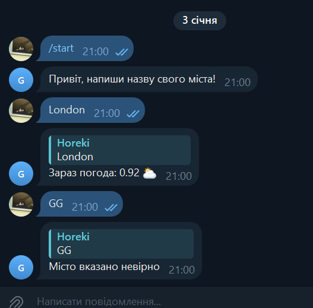

<h1 align="center">Weather Telegram Bot </h1>
<h4 align="center">
  <a href="https://t.me/horekisun">Telegram</a>
  |
  <a href="https://github.com/TheDmitryY/WeatherBot#-installation"">Installation</a>
</h4>

<p align="center">

<a href="https://t.me/horekisun">
    
  </a>


Weather Telegram Bot - is a telegram bot which you can find weather from your city in telegram.
</p>

## Preview📷



## ✨ Features

- Each country / city
- Comfort interface
- Free application
- Using free API

## 🤖 Installation

Install Repository

``` git clone https://github.com/TheDmitryY/WeatherBot ```

Enter to directory

``` cd WeatherBot/src ```

Run main file

``` python main.py ```